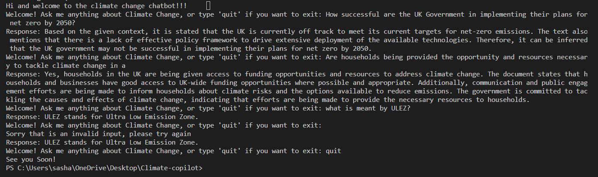

# Climate-Copilot
Welcome to my Readme for my climate change chatbot!!!

Author: Alexandra Marie Tribe
#### Notes:
- Ignore [grab_text](/grab_text.py), that is strictly for me and was a draft for the [ingest_text.py](/ingest_text.py)

## Table of Contents :)
- [Description](#description)
- [Technologies Used](#built-with)
- [How to run the application](#how-to-run-this-application)
- [The code section](#the-code-section)
    - [Fetching the PDF links](#fetching-the-pdfs)
    - [Downloading the Report PDFs](#download-all-the-pdfs)
    - [Preparing the LLM](#ingest-text)
    - [Creating the Chatbot](#create-the-chatbot)
    - [The Trigger File](#the-main-python-file-that-triggers-the-applet)
- [Challenges Faced](#what-has-been-challenging-for-me)
- [The Future State of this Product](#the-future-state-of-this-application)
- [Acknowledgements](#acknowledgments)


## Description 
An LLM that processes a corpus of climate change documents to the pinecone server, including a prompt for users to make queries relating to climate change environment. 
This project saves the user the effort to go through all the reports to find information of a particular subject by providing a prompt for them to type in their query and the LLM produces an answer.
### The link that holds all of the reports:
https://www.theccc.org.uk/publications/

## Built with
- 
- 
- 
- 

- Langchain: 
    https://python.langchain.com/docs/get_started/introduction
- Pinecone: https://www.pinecone.io/
- requests
    - Important for web scraping
- OpenAI
    - a tool that powers my LLM model, powers 
- BeautifulSoup
    - Makes it easier for me to find pdf links of a given website


## How to Run This application
1. Get a free API Key from https://openai.com/
    - have it put in a local env file for security purposes
2. Run this in your terminal:
```console
python main.py
```
Should be able to communicate with the chatbot like this:


Watch the demo here!!
[<video src="chatbot_demo.mp4" controls title="Title"></video>]

## The Code Section
### Fetching the PDFs

1. First I scrape the pdf links from the given website using BeautifulSoup and Requests library:

```python
import requests
from bs4 import BeautifulSoup
```
2. Made a function that gets all the links that contains reports
    - Please see [all_report_links(url)](/get_all_pdfs.py::allreportlinks)
3. Get report links from all pages
    - [get_report_links](/get_all_pdfs.py::get_report_links)
4. Fetch the pdf url from every page of the specific report
    - [get_pdf](/get_all_pdfs.py::get_pdf)
5. Make a list of all the pdf urls, calling the functions above:
    - [put_together](/get_all_pdfs.py::put_together)
6. Convert the list into a file that contains all the pdf links
    - [put_pdfs_in_file](/get_all_pdfs.py::put_pdfs_in_file)
7. Create main() which triggers all the processes above:
    - [main](/get_all_pdfs.py:main)

### Download all the PDFs
1. import OS and Requests
    ```python
    import requests
    import os
    ```
2. Made a function that downloads pdf based on given url
    - [download_link](/download_pdf.py::download_link)
3. A function that calls the above for every link given in the file
    - [download_all_links](/download_pdf.py::download_all_links)

### Ingest text
1. Import Langchain methods needed, OpenAI for embeddings, and pinecone to set up client (where all the data are stored to be fetched later)
```python
import PyPDF2
import os
from langchain.document_loaders import PyPDFLoader
from langchain.vectorstores import FAISS
from langchain.embeddings.openai import OpenAIEmbeddings
from langchain.text_splitter import RecursiveCharacterTextSplitter
import pinecone
from langchain.vectorstores import Pinecone
if os.path.exists("env.py"):
    import env
```
2. Initiate the pinecone-client, this first gets set up in its webstie where you create and *index* which acts as a folder to store your tokens at
```python
# initialises pinecone client 
pinecone.init(api_key=os.environ.get("PINECONE_SECRET_KEY"),
              environment=os.environ.get("PINECONE_ENVIRONMENT_REGION"))
active_indexes = pinecone.list_indexes()
# gets index of the client you are submitting embeddings to
index = pinecone.Index('climate-change')

```
3. Load the PDFs into langchain's loader in preparation for tokenization and embeddings
- [load_pdf](/ingest_text.py::load_pdf)

4. Extract the text given to split the text into tokens with sizes of 250 characters, having a 50 character overlap to improve sentimental analysis
- [extract_text](/ingest_text.py::extract_text)

5. Upload every PDF document to the pinecone client, calling the functions above for preprocessing
- [upload_pdf](/ingest_text.py::upload_pdf)

### Create the chatbot
1. Import Langchain methods needed, OpenAI and pinecone to fetch the LLM and to create a prompt for user to communicate with the LLM
```python
from langchain.embeddings.openai import OpenAIEmbeddings
from langchain.vectorstores import Pinecone 
from langchain.chat_models import ChatOpenAI
from langchain.chains import ConversationalRetrievalChain
import pinecone
import os
```
2. Build a langchain Agent that the user will communicate with 
    - [run_llm](/core.py::run_llm)

### The Main Python File that triggers the applet
Fetches the [run_llm](/core.py::run_llm) from the [core.py](/core.py) file
```python 
from core import run_llm
from dataclasses import dataclass
import os
if os.path.exists("env.py"):
    import env

# Runs the whole program
if __name__ == "__main__":
    run_llm(os.environ.get("PINECONE_ENVIRONMENT_REGION"))

```

## What has been challenging for me:
- Finding the best way to grab the text inside of the PDF reports
    - Tried to get Langchain to fetch data straight from the url link instead of downloading all the files
    - So I resulted in downloading all of them, saving them to [pdfs](/pdfs/) instead

- Trying to get Streamlit to work however it has been unsuccessful with my computer as the technologies I use is incompatible to streamlit

## The Future State of this Application
- Implementing a GUI to make the prompt more user-friendly
    - Ideally it will have a similar interface to a chat like whatsapp application for example 

## Acknowledgments
I thank the Xander team and my peers in the academy for the support of building this application.